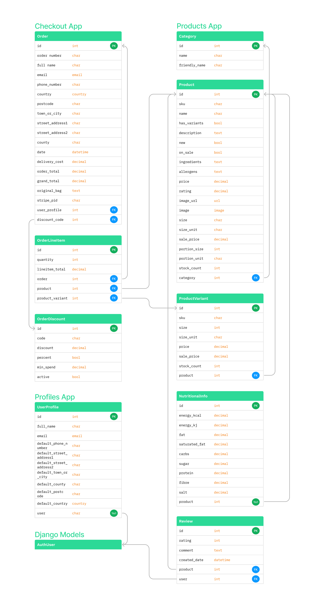

<h1 align="center" id="title"></h1>


Welcome to Keto Kreations, where delicious meets nutritious! Our mission is to fuel your body and delight your palate with a delectable array of ketogenic culinary wonders. At Keto Kreations, we understand the importance of embracing a low-carb, high-fat lifestyle, and we've curated a collection of mouthwatering products to support your journey.

Indulge in guilt-free treats, savory snacks, and wholesome staples that adhere to the principles of the ketogenic diet. From satisfying your sweet tooth with our luscious sweet treats to discovering innovative and flavorful twists on traditional favorites, Keto Kreations is your go-to destination for all things keto.

Our commitment goes beyond mere products; we're here to inspire and empower you on your wellness journey. Immerse yourself in a world of taste and health as you explore the culinary delights that Keto Kreations has to offer. We believe that eating well should never mean sacrificing flavor, and we've made it our mission to prove it.

Fuel your body, delight your palate. Dive into Keto Kreations, where every bite is a celebration of delicious, nutritious living. Welcome to a world of mouthwatering possibilities – your keto adventure starts here!

Keto Kreations was created as my fourth and final milestone project for the Code Institutes Level 5 Diploma in Web Application Development.

[View the live project here.](https://keto-kreations-25ff0a2cbc9e.herokuapp.com/)


## User Experience (UX) 

### User stories

<table>
  <thead>
    <tr>
      <th>As a...</th>
      <th>I want to be able to…</th>
      <th>So that I can…</th>
    </tr>
    <tr>
      <th colspan="3">Viewing and Navigation</th>
    </tr>
  </thead>
  <tbody>
    <tr>
      <td>Shopper</td>
      <td>Immediately understand the purpose of the site</td>
      <td>Tell quickly whether this site is going to be of interest to me</td>
    </tr>
    <tr>
      <td>Shopper</td>
      <td>View a list of products</td>
      <td>Select some to purchase</td>
    </tr>
    <tr>
      <td>Shopper</td>
      <td>View individual product details</td>
      <td>Identify the price, description, product rating, product image, available size, allergens, ingredients and nutritional information on products I would like to purchase</td>
    </tr>
    <tr>
      <td>Shopper</td>
      <td>Quickly identify deals, clearance items and special offers</td>
      <td>Take advantage of special savings on products I'd like to purchase</td>
    </tr>
    <tr>
      <td>Shopper</td>
      <td>Easily view the total of my purchases at any time</td>
      <td>Avoid spending too much</td>
    </tr>
    <tr>
      <td>Shopper</td>
      <td>See what past customers think about the products</td>
      <td>Can make a more informed decision about the products I am purchasing</td>
    </tr>
    </tbody>
    <thead>
    <tr>
      <th colspan="3">Registration and User Accounts</th>
    </tr>
    </thead>
    <tbody>
    <tr>
      <td>Registered User</td>
      <td>Easily register for an account</td>
      <td>Have a personal account and be able to view my profile</td>
    </tr>
    <tr>
      <td>Registered User</td>
      <td>Easily login or logout</td>
      <td>Access my personal account information</td>
    </tr>
    <tr>
      <td>Registered User</td>
      <td>Easily recover my password in case I forget it</td>
      <td>Recover access to my account</td>
    </tr>
    <tr>
      <td>Registered User</td>
      <td>Receive an email confirmation after registering</td>
      <td>Verify that my account registration was successful</td>
    </tr>
    <tr>
      <td>Registered User</td>
      <td>Have a personalised used profile</td>
      <td>View my personal order history and order confirmation, and save my payment information</td>
    </tr>
    <tr>
      <td>Registered User</td>
      <td>Have my email address verified by the site</td>
      <td>Ensure my email address and personal data are safe and secure</td>
    </tr>
    <tr>
      <td>Registered User</td>
      <td>See my past order history</td>
      <td>Make repeat orders</td>
    </tr>
    <tr>
      <td>Registered User</td>
      <td>See my past reviews</td>
      <td>Jog my memory on products I liked or disliked in the past if I haven't purchased in a long time</td>
    </tr>
    </tbody>
    <thead>
    <tr>
      <th colspan="3">Sorting and Searching</th>
    </tr>
    </thead>
    <tbody>
    <tr>
      <td>Shopper</td>
      <td>Sort the list of available products</td>
      <td>Easily identify the best rated, best priced and categorically sorted products</td>
    </tr>
    <tr>
      <td>Shopper</td>
      <td>Sort a specific category of product</td>
      <td>Find the best priced or best rated product in a specific category, or sort the products in that category by name</td>
    </tr>
    <tr>
      <td>Shopper</td>
      <td>Sort multiple categories of products simultaneously</td>
      <td>Find the best priced or best rated products across broad categories such as 'sweet treats' or 'condiments'</td>
    </tr>
    <tr>
      <td>Shopper</td>
      <td>Search for a product by name or description</td>
      <td>Find a specific product I would like to purchase</td>
    </tr>
    <tr>
      <td>Shopper</td>
      <td>Easily see what I've searched for and the number of results</td>
      <td>Quickly decide whether the product I want is available</td>
    </tr>
    <tr>
      <td>Shopper</td>
      <td>Easily see if a product is out of stock</td>
      <td>Quickly see that the product I want isn't available for purchase</td>
    </tr>
    <tr>
      <td>Shopper</td>
      <td>Save my billing and shipping details</td>
      <td>Checkout even quicker and more conveniently on future orders</td>
    </tr>
    <tr>
      <td>Shopper</td>
      <td>Leave my views and feedback about products</td>
      <td>Help future shoppers make informed decisions about purchases</td>
    </tr>
    <tr>
      <td>Shopper</td>
      <td>Edit/Update my reviews</td>
      <td>Change my review if I change my mind about a product or the the product quality changes over time</td>
    </tr>
    <tr>
      <td>Shopper</td>
      <td>Delete my reviews</td>
      <td>Remove my review if I feel it is no longer accurate but don't want to leave any further reviews</td>
    </tr>
    </tbody>
    <thead>
    <tr>
      <th colspan="3">Purchasing and Checkout</th>
    </tr>
    </thead>
    <tbody>
    <tr>
      <td>Shopper</td>
      <td>Easily select the size and quantity of a product when purchasing it</td>
      <td>Ensure I don't accidentally select the wrong product, quantity or size</td>
    </tr>
    <tr>
      <td>Shopper</td>
      <td>View items in my bag to be purchased</td>
      <td>Identify the total cost of my purchase and all items I will receive</td>
    </tr>
    <tr>
      <td>Shopper</td>
      <td>View the total cost of my purchase before checking out</td>
      <td>So that I can see what the total cost of my purchase is including any additional costs such as shipping are   before making my final purchase</td>
    </tr>
    <tr>
      <td>Shopper</td>
      <td>Adjust the quantity of individual items in my bag</td>
      <td>Easily make changes to my purchase before checkout</td>
    </tr>
    <tr>
      <td>Shopper</td>
      <td>Easily enter my payment information</td>
      <td>Check out quickly with no hassles</td>
    </tr>
    <tr>
      <td>Shopper</td>
      <td>Feel my personal and payment  information is safe and secure</td>
      <td>Confidently product the needed information to make a purchase</td>
    </tr>
    <tr>
      <td>Shopper</td>
      <td>View an order confirmation at checkout</td>
      <td>Verify that I haven't made any mistakes</td>
    </tr>
    <tr>
      <td>Shopper</td>
      <td>Receive an email confirmation after checking out</td>
      <td>Keep the confirmation of what I've purchase for my records</td>
    </tr>
    <tr>
      <td>Shopper</td>
      <td>Contact the store easily with any questions or concerns</td>
      <td>Get further information about a product or purchase</td>
    </tr>
    <tr>
      <td>Shopper</td>
      <td>See what discounts have been applied to my order</td>
      <td>Identify the total cost of my purchase after discounts are applied</td>
    </tr>
        <tr>
      <td>Shopper</td>
      <td>See at a glance if there are any items in my shopping basket</td>
      <td>See quickly at a glance if there are any items already in my basket</td>
    </tr>
    <tr>
      <td>Shopper</td>
      <td>Be informed if the store doesn't have enough stock to fulfill the amount I need</td>
      <td>Only order the amounts currently available so as not to cause any delays with my order or have to deal with   refunds later on in the sale cycle</td>
    </tr>
    <tr>
      <td>Shopper</td>
      <td>See how much I need to spend to qualify for free shipping</td>
      <td>Ensure I am getting the best value on potentially larger purchases</td>
    </tr>
    <tr>
      <td>Shopper</td>
      <td>Be able to checkout without registering for an account</td>
      <td>Checkout quickly and easily even if I don't want to register for an account with the store</td>
    </tr>
    </tbody>
    <thead>
    <tr>
      <th colspan="3">Admin and Store Management</th>
    </tr>
    </thead>
    <tbody>
    <tr>
      <td>Store Owner/Staff Member</td>
      <td>Add a product</td>
      <td>Add new items to my store</td>
    </tr>
    <tr>
      <td>Store Owner/Staff Member</td>
      <td>Edit/Update a product</td>
      <td>Change product prices, descriptions, images and other product criteria</td>
    </tr>
    <tr>
      <td>Store Owner/Staff Member</td>
      <td>Delete a product</td>
      <td>Remove items that are no longer for sale</td>
    </tr>
    <tr>
      <td>Store Owner/Staff Member</td>
      <td>Manage Stock levels</td>
      <td>Keep track of available inventory</td>
    </tr>
    <tr>
      <td>Store Owner/Staff Member</td>
      <td>Add a discount code</td>
      <td>Add new discount codes to my store</td>
    </tr>
    <tr>
      <td>Store Owner/Staff Member</td>
      <td>Edit/Update a discount code</td>
      <td>Change discount amounts and criteria and whether or not the codes are currently active or note</td>
    </tr>
    <tr>
      <td>Store Owner/Staff Member</td>
      <td>Delete a discount code</td>
      <td>Remove discount codes that are no longer valid or required</td>
    </tr>
  </tbody>
</table>


### Design

#### Colour Scheme
The colour scheme was primarily crafted with a focus on aesthetics and accessibility. I decided to go with a simplistic and minimalist style choice, mostly using the Bootstrap colour pallette, this minimalist and understated approach I feel provided an excellent contrast against the vibrant colours of the food/product pictures, allowing the products themselves to shine through the design.

-   ##### Main Colours Used
    - Text colour 1 - Dark Blue `#084298`
    - Text colour 2 - Bootstrap Standard Black `#212529`
    - Text colour 3 - Bootstrap Standard `text-muted` class `rgba(33, 37, 41, 0.75)`
    - Background colour - `#ffffff`
    - Button colour 1 - Bootstrap `primary` class `#0d6efd`
    - Button colour 2 - Bootstrap `success` class `#198754`
    - Button colour 3 - Bootstrap `danger` class `#dc3545`
    - Button text colour - `#ffffff`
    - Badge colour 1 (sale) - Bootstrap `danger` class `#dc3545`
    - Badge colour 2 (new) - Bootstrap `primary` class `#0d6efd`
    - Badge colour 3 (out of stock) - Bootstrap `warning` class `#FFC107`
    - Badge text colour 1 & 2 - `#ffffff`
    - Badge text colour 3 - Bootstrap Standard Black `#212529`

#### Colour Accessibility
			
To ensure the colours chosen met the WCAG 2.1 AA guidelines as minimum and AAA guidelines where possible as with previous projects I used Coolors Contrast Checker which can be found [here](https://coolors.co/contrast-checker/000000-ffffff). However Coolors doesn't support `rgba` so for these colours I used Siege Media which can be found [here](https://www.siegemedia.com/contrast-ratio).

For further information on these guidelines, you can visit the following link. [Web Content Accessibility Guidelines (WCAG) 2.1 (w3.org)](https://www.w3.org/TR/WCAG21/).
        

- ##### Colour Palette and Results
    - Text Colour 1 - [Coolors Contrast Checker](https://coolors.co/contrast-checker/084298-ffffff)<br>
    

    - Text Colour 2 - [Coolors Contrast Checker](https://coolors.co/contrast-checker/212529-ffffff)<br>
    

    - Text Colour 3 - [Siege Media Contrast Checker](https://www.siegemedia.com/contrast-ratio#rgba%2833%2C%2037%2C%2041%2C%200.75%29-on-white)<br>
      

    - Button Colour 1 Text - [Coolors Contrast Checker](https://coolors.co/contrast-checker/ffffff-0d6efd)<br>
    

    - Button Colour 2 Text - [Coolors Contrast Checker](https://coolors.co/contrast-checker/ffffff-198754)<br>
    

    - Button Colour 3 Text - [Coolors Contrast Checker](https://coolors.co/contrast-checker/ffffff-dc3545)<br>
    

    - Badge Colour 1 Text - [Coolors Contrast Checker](https://coolors.co/contrast-checker/ffffff-dc3545)<br>
    

    - Badge Colour 2 Text - [Coolors Contrast Checker](https://coolors.co/contrast-checker/ffffff-0d6efd)<br>
    

    - Badge Colour 3 Text - [Coolors Contrast Checker](https://coolors.co/contrast-checker/212529-ffc107)<br>
    

    


#### Typography
The main considerations for the font were aesthetics and accessibility. I chose the Roboto Condensed font as a personal preference as I like the way it looks on the page. It is also a very widely used font developed by Google.this ensures a fairly wide availability across devises.

 - ##### Fallback Font

    For my fallback font I have opted to stick with the Google recommended fonts when downloading the Roboto Condensed font, if no fonts can be found on the user system is will default to the sans-serif family which has many widely used fonts including Arial. Arial is the most widely used font for both online and printed media. Arial is said to be one of the safest web fonts, and is available on all major operating systems.  


#### Imagery

 - ##### Logo
    The Keto Kreations logo was created using Logo.com which can be found [here](https://logo.com/).
    

- ##### Welcome Image
    The welcome/hero image was found at Freepik [here](https://www.freepik.com/free-photo/ketogenic-low-carbs-diet-food-selection-white-wall_12757333.htm#query=keto%20food%20transparent&position=26&from_view=search&track=ais&uuid=6594cbc6-5c09-4e67-925f-dfdfc7f00692)
    
    Attribution - <a href="https://www.freepik.com/free-photo/ketogenic-low-carbs-diet-food-selection-white-wall_12757333.htm#query=keto%20food%20transparent&position=26&from_view=search&track=ais&uuid=6594cbc6-5c09-4e67-925f-dfdfc7f00692">Image by master1305</a> on Freepik

- ##### 404 Image
    The image used on the 404 page was found at Freepik [here](https://www.freepik.com/free-vector/error-404-concept-landing-page_4660894.htm#query=404%20image&position=9&from_view=search&track=ais&uuid=b78a78a6-bfe8-4b6a-a66f-7ce0423dbe75)
    
    Attribution - <a href="https://www.freepik.com/free-vector/error-404-concept-landing-page_4660894.htm#query=404%20image&position=9&from_view=search&track=ais&uuid=b78a78a6-bfe8-4b6a-a66f-7ce0423dbe75">Image by pikisuperstar</a> on Freepik

- #### Product Images
    All product images were also sourced from Freepik, all of the attributions for these images are in the below table.

<table>
  <thead>
    <tr>
      <th>Product</th>
      <th>SKU</th>
      <th>Image</th>
      <th>Attribution</th>
    </tr>
  </thead>
  <tbody>
    <tr>
      <td>Keto Bread</td>
      <td>PAN-BRE-BRE</td>
      <td></td>
      <td><a href="https://www.freepik.com/free-photo/front-view-black-bread-slices-black-board-mixed-colors-distressed-background_17243793.htm#query=bread%20sliced&position=20&from_view=search&track=ais&uuid=4fd5b5e9-a0c9-4b07-b1a3-efb33ab3b7ac">Image by mdjaff</a> on Freepik</td>
    </tr>
    <tr>
      <td>Keto Bread rolls</td>
      <td>PAN-BRE-BRR</td>
      <td></td>
      <td><a href="https://www.freepik.com/free-photo/fresh-brown-buns-wooden-board-light-background_13517267.htm#query=bread%20roll%20bap&position=30&from_view=search&track=ais&uuid=2f2492e6-a203-4a21-8bef-d9318998fb2c">Image by azerbaijan_stockers</a> on Freepik</td>
    </tr>
    <tr>
      <td>Keto Bagels</td>
      <td>PAN-BRE-BAG</td>
      <td></td>
      <td><a href="https://www.freepik.com/free-photo/concept-tasty-food-bagel-top-view_40451427.htm#page=2&query=bagels&position=13&from_view=search&track=sph&uuid=e3e7e088-9004-48b4-b2d3-55167b0fc625">Image by atlascompany</a> on Freepik</td>
    </tr>
    <tr>
      <td>Keto Fusilli Pasta</td>
      <td>PAN-PAS-FUS</td>
      <td></td>
      <td><a href="https://www.freepik.com/free-photo/wooden-bowl-italian-uncooked-dry-pasta-fusilli-high-quality-photo_13211012.htm#query=dry%20pasta&position=11&from_view=search&track=ais&uuid=78f523ff-5eba-48e4-b3cb-ab9aa74c0976">Image by azerbaijan_stockers</a> on Freepik</td>
    </tr>
    <tr>
      <td>Keto Spaghetti Pasta</td>
      <td>PAN-PAS-SPA</td>
      <td></td>
      <td><a href="https://www.freepik.com/free-photo/raw-dry-spaghetti-glass-jar-marble-table_16937021.htm#query=dry%20spaghetti&position=11&from_view=search&track=ais&uuid=0139bc79-5dd6-4a24-82a1-e19cc7645619">Image by azerbaijan_stockers</a> on Freepik</td>
    </tr>
    <tr>
      <td>Cauliflower Rice</td>
      <td>PAN-PAS-CAU</td>
      <td></td>
      <td><a href="https://www.freepik.com/free-photo/yellow-delicious-cuscus-plate_12178556.htm?query=riced%20cauliflower#from_view=detail_alsolike#position=0&query=riced+cauliflower">Image by senivpetro</a> on Freepik</td>
    </tr>
    <tr>
      <td>Keto Brownies</td>
      <td>SWE-CAK-BRO</td>
      <td></td>
      <td><a href="https://www.freepik.com/free-photo/overhead-shot-freshly-baked-brownies-wooden-board_11600017.htm#query=brownies&position=23&from_view=search&track=sph&uuid=1b094c71-3b60-46a9-8a8c-700f2d09362e">Image by wirestock</a> on Freepik</td>
    </tr>
    <tr>
      <td>Keto Cookies</td>
      <td>SWE-CAK-COO</td>
      <td></td>
      <td><a href="https://www.freepik.com/free-photo/top-view-chocolate-cookies_9469437.htm#page=2&query=cookies&position=3&from_view=search&track=sph&uuid=6220e534-55ca-461c-b248-fd62a9e6ecdb">Image by Freepik</a></td>
    </tr>
    <tr>
      <td>Keto Popcorn</td>
      <td>SWE-POP-POP-120</td>
      <td></td>
      <td><a href="https://www.freepik.com/free-photo/caramel-popcorn-table_1274451.htm#query=popcorn&position=28&from_view=search&track=sph&uuid=0338ee99-5b19-4d53-aeda-ab5d4813ce3d">Image by topntp26</a> on Freepik</td>
    </tr>
    <tr>
      <td>Keto Caramel Popcorn</td>
      <td>SWE-POP-CAR-120</td>
      <td></td>
      <td><a href="https://www.freepik.com/free-photo/delicious-popcorn_6543842.htm#query=caramel%20popcorn&position=10&from_view=search&track=ais&uuid=e8a2ab27-db5f-4288-bc3a-27771f1097ec">Image by Racool_studio</a> on Freepik</td>
    </tr>
    <tr>
      <td>Keto Protein Bars</td>
      <td>SWE-BAR-PRO-120</td>
      <td></td>
      <td><a href="https://www.freepik.com/free-photo/top-view-blueberry-snack-bars_8810571.htm#query=protein%20bar&position=15&from_view=search&track=ais&uuid=9926ea94-e326-4b8c-a11a-13d1a58b4997">Image by Freepik</a></td>
    </tr>
    <tr>
      <td>Fat bombs</td>
      <td>SWE-CAK-FAT-180</td>
      <td></td>
      <td><a href="https://www.freepik.com/free-photo/chocolate-balls_4378130.htm#query=chocolate%20protein%20ball&position=3&from_view=search&track=ais&uuid=2f922c19-9bf2-4575-892a-8ac53c90d618">Image by Freepik</a></td>
    </tr>
    <tr>
      <td>Keto Chocolate Bars</td>
      <td>SWE-BAR-CHO-120</td>
      <td></td>
      <td><a href="https://www.freepik.com/free-photo/chocolate-cocoa-crumbs_4822037.htm#query=chocolate%20bar%20homemade&position=28&from_view=search&track=ais&uuid=fb9859a4-57a0-412c-bdf3-b8bec93ed875">Image by Freepik</a></td>
    </tr>
    <tr>
      <td>Keto Sweets</td>
      <td>SWE-SWE-SWE-120</td>
      <td></td>
      <td><a href="https://www.freepik.com/free-photo/colorful-marmelades-out-paper-wrap_10464684.htm#query=homemade%20sour%20sweets&position=32&from_view=search&track=ais&uuid=a4bdac4c-c410-4439-96cd-6ec512275ce7">Image by azerbaijan_stockers</a> on Freepik</td>
    </tr>
    <tr>
      <td>Keto Ketchup</td>
      <td>CON-SAU-KET-460</td>
      <td></td>
      <td><a href="https://www.freepik.com/free-photo/fresh-tomato-juice-ready-serve_13901110.htm#query=homemade%20ketchup&position=17&from_view=search&track=ais&uuid=c1d3eb5d-4ef6-4dc8-9d1b-6b6c11d7bd2f">Image by jcomp</a> on Freepik</td>
    </tr>
    <tr>
      <td>Keto Sticky BBQ Sauce</td>
      <td>CON-SAU-STI-460</td>
      <td></td>
      <td><a href="https://www.freepik.com/free-photo/filling-red-confiture-into-red-cup-from-spoon_6422433.htm#page=3&query=bbq%20sauce&position=12&from_view=search&track=ais&uuid=41a9c062-1ce3-443a-bc8d-7be88d26a5de">Image by azerbaijan_stockers</a> on Freepik</td>
    </tr>
    <tr>
      <td>Chilli Sauce</td>
      <td>CON-SAU-CHI-460</td>
      <td></td>
      <td><a href="https://www.freepik.com/free-photo/chili-sauce-peppers-dark-wooden-surface_13806336.htm#page=4&query=homemade%20bbq%20sauce&position=41&from_view=search&track=ais&uuid=1806e449-4564-4e9b-a546-77843f6a34d8">Image by jcomp</a> on Freepik</td>
    </tr>
    <tr>
      <td>Keto Curry Sauce</td>
      <td>CON-SAU-CUR-450</td>
      <td></td>
      <td><a href="https://www.freepik.com/free-photo/front-view-delicious-tomato-soup-cooked-from-fresh-tomatoes-with-seasonings-dark-space_15005434.htm#query=tika%20sauce&position=48&from_view=search&track=ais&uuid=b33bbe1b-1360-43f6-82ba-c3dabcbaf555">Image by KamranAydinov</a> on Freepik</td>
    </tr>
    <tr>
      <td>Keto Pasta Sauce</td>
      <td>CON-SAU-PAS</td>
      <td></td>
      <td><a href="https://www.freepik.com/free-photo/bottle-borscht-tomatoes-garlic_5969440.htm#page=7&query=tomato%20pasta%20sauce%20jar&position=30&from_view=search&track=ais&uuid=fa9b956b-b24d-4cbd-b908-87283a7bb8b7">Image by Freepik</a></td>
    </tr>
    <tr>
      <td>Coconut Oil</td>
      <td>CON-OIL-COC</td>
      <td></td>
      <td><a href="https://www.freepik.com/free-photo/jug-coconut-oil-whit-coconut-put-dark-background_10992006.htm#query=coconut%20oil%20homemade&position=11&from_view=search&track=ais&uuid=dc5f5871-1436-455d-bd6e-adc8251663f4">Image by jcomp</a> on Freepik</td>
    </tr>
    <tr>
      <td>Extra Virgin Olive Oil</td>
      <td>CON-OIL-OLI</td>
      <td></td>
      <td><a href="https://www.freepik.com/free-photo/tasty-looking-olives-extra-virgin-olive-oil-olive-leafs-dark-wooden-background_17234457.htm#query=olive%20oil&position=10&from_view=search&track=ais&uuid=d5b32484-2bdf-41a1-b8cd-5a9bd98b1dd5">Image by wirestock</a> on Freepik</td>
    </tr>
  </tbody>
</table>
<br>

All other imagery on the website are basic icons obtained from Font Awesome which can be found [here](https://fontawesome.com/).


### Wireframes
The wireframes were creates using [Figma](https://www.figma.com/). I have deviated somewhat from my original wireframes, but this was mainly design preference and ensuring a good responsive layout on smaller screens.

I did not create separate wireframes for mobile and tablet as the layout is identical.

- ##### Desktop Wireframes


- ##### Tablet & Mobile Wireframes

  
### Database Schema
The database schema flow charts were created using [Figma](https://www.figma.com/).



[Back to top](#title)  

### Features

-   Fully responsive across all screen sizes.

    #### Laptop / Desktop

    
    
    
    
    
    
    

    #### Tablet

    
    
    
    
    
    
    
    

    #### Mobile

    
    
    
    
    
    
    
    
    
    

-   Intuitive and easy to navigate using the top navbar on larger screens and sidenav on smaller screens. There are various appropriately marked buttons as well as instructions on what to do where it maybe isn't so clear to the user. 

    
    
    

-   The ability to log in to an existing account or register a new one, and log out once logged in.

    
    
    

-   A dynamic "homepage", for users thats are logged out they are presented with a "Welcome screen" and for users that are logged in they are taken to their list of budgets where they can select to view or add new budgets.

    
    

-   A budget management section where the user is presented with helpful instructions on how to add, edit or delete transactions as well as rename or delete their budget. They can use the various buttons, or click on an existing transaction in order to edit or delete it.

    

-   The ability to add, edit or delete transactions as well as rename or delete their budget.

    
    
    
    
    

-   A full budget table showing all the users income and outgoings that they have added to that specific budget.

    

-   Handy insights into the users budget, conveniently presented in both a pie chart which shows the percentage of their total income that is being spent in each transaction category, and a bar chart which shoes the total amount that is being spent on each transaction category. The user is able to hover over each colour for further info or use the key button to show which colour represents which category

    
    

-   The user is provided numerous ways to get in touch for help via social media links placed in the footer or by submitting a web form by clicking the email icon in the footer or the support link in the navbar. Once a support message is sent the user is also sent an auto reply via email to advise of the current response times.

    
    

-   A profile page is provided where the user can either change their password or delete their account entirely.

    
    

-   A custom 404 page that informs the user the page they are looking for hasn't been found and then automatically redirects them back to the homepage. 

    

-   Defensive programming has been used throughout the development of the application, to prompt users when they are either about to permanently delete something that cannot be done such as a transaction, full budget or their account as well as to stop users accessing pages they aren't authorised to access, for instance any page that requires a user to be logged in, or other users budgets and profiles whether logged in or not.

    

    

    

    

    


### Future Features

-   I would like to incorporate an intelligent function into the app in the future where users are provided helpful and personalised tips and advice about their budgets.
-   I would also like to implement 2 factor authorisation given that a user can store quite sensitive data on this app.
-   I would also like to add a storage facility where users can store documents relating to their budget such as payslips, invoices and receipts.

### Accessibility
-   The use of semantic HTML.
-   Ensuring the colours and text use meet accessibility standards set by [w3.org](https://www.w3.org/TR/WCAG21/).
-   Ensuring all clickable buttons and links are tabbable using the keyboard.
-   Using descriptive alt tags on all images.
-   Using correct aria labels where necessary.
-   Being mindful in the creation of the design to ensure it is intuitive and as easy to navigate as possible.

### Development Process
As well as using [Figma](https://www.figma.com/) to create wireframes and flow charts for this project, I also used Figma's Kanban template to keep track of tasks as I found the "sticky note" style more user friendly and it suited my style of task management better.

You can view the Kanban board [here](https://www.figma.com/file/kG9qjy6KkTMRNKzj4HqHlx/Budgify-Kanban?type=whiteboard&node-id=0%3A1&t=cNNHQPXaYC5tNSht-1).


[Back to top](#title)  

## Technologies Used

### Languages Used
-   HTML
-   CSS
-   Vanilla javaScript
-   Python


### Databases Used
-   PostgreSQL - A relational database

### Frameworks, Libraries & Programs Used

-   [Am I Responsive](https://amiresponsive.co.uk/) - To create the website mockup images at the top of the README.
-   [Bootstrap](https://getbootstrap.com/) Version 5.3.0 - For the layout and framework of the website, it was also used to create the various modals which were then restyled to math the rest of the website.
-   [Chart JS](https://www.chartjs.org/) - To create the pie chart and bar chart used in the insights section of the budget page.
-   [Cloud Convert](https://cloudconvert.com/) - To compress and convert images to webp.
-   [Code Institute PEP8 Python Linter](https://pep8ci.herokuapp.com/) - To check for linting errors in my python code.
-   [Coolors](https://coolors.co/) - To check contrast and accessibility of the colours I chose to use.
-   [ElephantSQL](https://www.elephantsql.com/) - To host my PostgreSQL database
-   [EmailJS](https://www.emailjs.com/) - To allows users to send support messages and also send an auto response to them upon receipt.
-   [Figma](https://www.figma.com/) - To create the wireframes, user journey flow chart and database schema flow chart as well as the Kanban feature to manage the development process.
-   [Flask](https://flask.palletsprojects.com/en/2.3.x/) - A micro framework
-   [Font Awesome](https://fontawesome.com/) - Used for the GitHub icon used in the footer button.
-   [Git](https://git-scm.com/) - For version control.
-   [GitHub](https://github.com/) - To store website files and repository for the website.
-   Google Dev Tools - Built into the chrome browser to test features and design and troubleshoot as I went along as well as for testing later on, these sections of the website which were then edited myself inside of Visual Stdio Code.
-   [Google Fonts](https://fonts.google.com/) - To import the fonts I chose for the website.
-   [Heroku](https://www.heroku.com/) - To host my application
-   [html5pattern.com](https://www.html5pattern.com/) - The the HTML 5 regex pattern to ensure users create a secure password.
-   [Jinja](https://jinja.palletsprojects.com/en/3.1.x/) - Templating engine
-   [JSHint](https://jshint.com/) - To validate and text javaScript code.
-   [Pixlr](https://pixlr.com/e/) - To edit images such as the favicon and welcome page image.
-   [randomkeygen.com](https://randomkeygen.com/) - To generate a strong password to use as my secret key within the flask app.
-   [Siege Media](https://www.siegemedia.com/contrast-ratio) - To check contrast and accessibility of the `rgba` colours I chose to use.
-   Lighthouse - Built into Google Dev Tools for testing.
-   [SQLAlchemy](https://www.sqlalchemy.org/) - Database abstraction library, used to interact with PostgreSQL.
-   [Visual Studio Code](https://code.visualstudio.com/) - Was used as my code editor to write code, version control using git and pushing changes for storage to GitHub.
-   [W3C](https://www.w3.org/) - To validate and test HTML and CSS code.


[Back to top](#title)  

## Testing

Please see [TESTING.md](TESTING.md) for all testing performed


## Deployment

The project was deployed to [Heroku](https://www.heroku.com/) using a free relational database from [ElephantSQL](https://www.elephantsql.com/). Before deploying to Heroku I would first set up the database so I will explain the deployment in 2 two parts.

### ElephantSQL

1. Navigate to [ElephantSQL.com](https://www.elephantsql.com/) and click “Get a managed database today”

2. Select “Try now for FREE” in the TINY TURTLE database plan.

3. Select “Log in with GitHub” and authorize ElephantSQL with your selected GitHub account.

4. In the Create new team form:
    - Add a team name (your own name is fine)
    - Read and agree to the Terms of Service
    - Select Yes for GDPR
    - Provide your email address
    - Click “Create Team”

5. Your account should now be successfully created.

6. Click “Create New Instance”.

7. Set up your plan:
    - Give your plan a Name (this is commonly the name of the project)
    - Select the Tiny Turtle (Free) plan
    - You can leave the Tags field blank

8. Select a data centre closest to you - I used EU-West-1 (Ireland).

9. Click "Review".

10. Check your details are correct and then click “Create instance”.

11. Your database should now be successfully created.

12. Return to the ElephantSQL dashboard and click on the database instance name for this project.

13. In the URL section, clicking the copy icon will copy the database URL to your clipboard. Keep this tab open as we will need this URL later.

### Heroku

1. To successfully deploy on Heroku we first need to create some files: a requirements.txt file and a Procfile.

2. The requirements.txt file contains all the applications and dependencies that are required to run the app. To create the requirements.txt file run the following command in the terminal:

    ```bash
    pip3 freeze --local > requirements.txt
    ```

3. The Procfile tells Heroku which files run the app and how to run it. To create the Procfile run the following command in the terminal:

    ```bash
    echo web: python run.py > Procfile
    ```

    NOTE: This is assuming the file used to launch your app is called run.py, otherwise replace with the correct file name. The Procfile uses a capital P and doesn't have a file extension on the end.

4. If the Procfile has been created correctly it will have the Heroku logo next to it. It is also important to check the Procfile contents, as sometimes on creation a blank line will be added at the end of the file. This can sometimes cause problems when deploying to Heroku, so if the file contains a blank line at the end, delete this and save the file. Make sure to save both these files and then add, commit and push them to GitHub.

5. Login (or sign up) to [Heroku.com](https://www.heroku.com).

6. Click the new button and then click create new app.

7. You will then be asked to give your app a name (these must be unique) and select a region. Once these are completed click create app.

8. You will now need to connect the Heroku app to the GitHub repository for the site. Select GitHub in the deployment section, find the correct repository for the project and then click connect.

9. Once the repository is connected, you will need to provide Heroku some config variables it needs to build the app. Click on the settings tab and then click reveal config vars button. You will now need to add the environment key/value variables that were used in the env.py file:

    | KEY | VALUE |
    | -- | -- |
    | IP | 0.0.0.0 |
    | PORT | 5000 |
    | SECRET_KEY| YOUR_SECRET_KEY* |
    | DATABASE_URL | POSTGRES_DB** |
    | DEBUG | TRUE*** |

    *This ca be anything you want but as the name suggests is a secret.

    **This is where we paste our URL from step 13 in ElephantSQL section.

    ***This variable is to be deleted once debugging is complete and you are ready to deploy your "production" app.

10. You're now ready to click the enable automatic deploys and create button. Heroku will start building the app.

11. We will now need to go the more button on the dashboard and select run console. This is where we will set up the tables in the database we have created on ElephantSQL.

12. Type python3 and then once the python interpreter opens, we can run the following:

    ```bash
    from budgify import db
    db.create_all()
    exit()
    ```

13. Now that the relational database has been set up and the tables created, we can now click open app and the budgify application should now open in a new tab.

### Forking the GitHub Repository

By forking the GitHub Repository we make a copy of the original repository on our GitHub account to view and/or make changes without affecting the original repository by using the following steps...

1. Login to GitHub.
2. Locate the repository, you can use a link you have been provided with or use the search function in the top left of the screen.
3. In the top right hand corner of the page locate and click the 'fork' button.
4. Near the bottom of the page click the green button that says 'Create Fork'.
5. You should now have a copy of the original repository in your GitHub account.

### Making a Local Clone

1. Login to GitHub.
2. Locate the repository, you can use a link you have been provided with or use the search function in the top left of the screen.
3. Near the top of the repository click the green 'Code' button.
4. To clone the repository using HTTPS, under HTTPS copy the link provided.
5. Open the terminal in your code editor. 
6. Change the current working directory to the location where you want the cloned directory to be made.
7. Type git clone, and then paste the URL you copied in Step 3.
8. Press Enter. Your local clone should be created.

[Back to top](#title)  

## Credits

### Code

-   Social Media Integration for Facebook, LinkedIn & Google - Code from [Abi Harrison Meta Tags Webinar](https://www.youtube.com/watch?v=t-4qqmikIqk).

All other small code snippets used are referenced in the code as a comment.

All other code was written by the developer.

### Content

-   Static content for this website was all written by the developer.
 

### Media

-   Logo - The logo was created using [Logo.com](https://logo.com/)

### Acknowledgements

I 100% couldn't have completed this project on my own so would like to acknowledge the following people for their contributions, whether they know they helped or not...

-   My Fiancé and children for their unwavering support.
-   [Iris Smok](https://github.com/Iris-Smok) my cohort facilitator for her support and for checking in on me when I have had to take some time away from the keyboard.
-   [Martina Terlevic](https://github.com/SephTheOverwitch) for her advice and support.
-   The [Code Institute](https://codeinstitute.net/) student support for checking in on me when it seems I might have gone MIA.
-   The people on my cohort for their support, encouragement and for reviewing my project.

[Back to top](#title)  