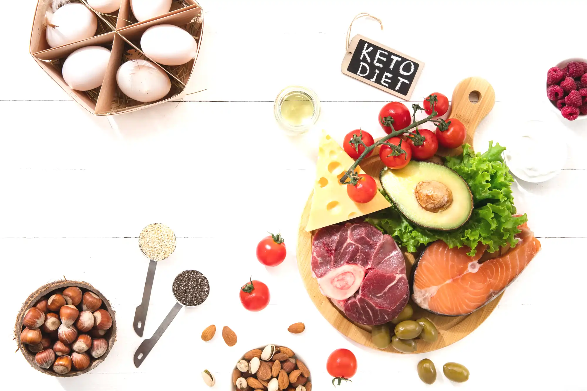
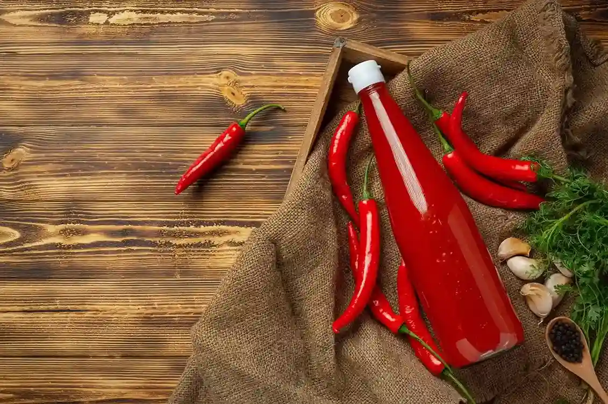
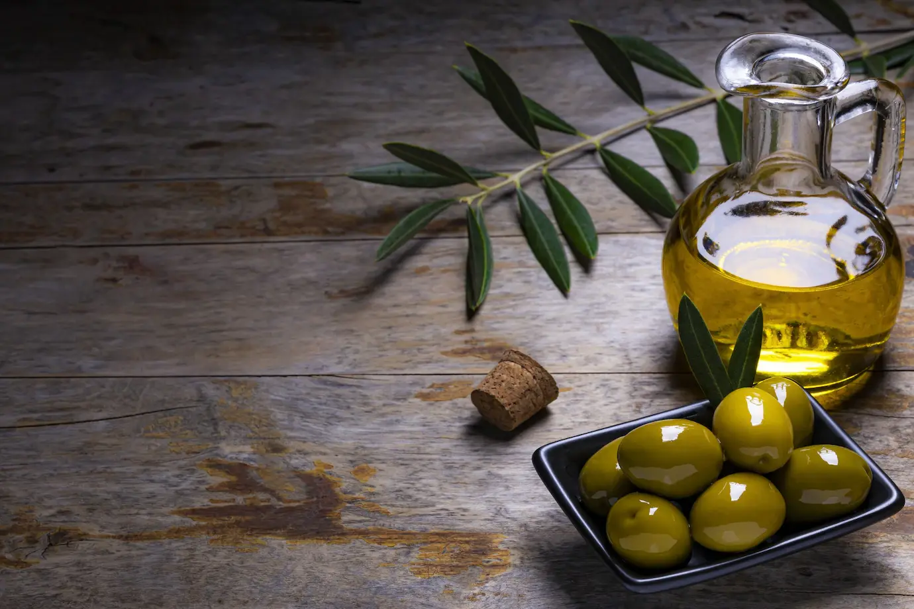

<h1 align="center" id="title"></h1>

Welcome to Keto Kreations, where delicious meets nutritious! Our mission is to fuel your body and delight your palate with a delectable array of ketogenic culinary wonders. At Keto Kreations, we understand the importance of embracing a low-carb, high-fat lifestyle, and we've curated a collection of mouthwatering products to support your journey.

Indulge in guilt-free treats, savory snacks, and wholesome staples that adhere to the principles of the ketogenic diet. From satisfying your sweet tooth with our luscious sweet treats to discovering innovative and flavorful twists on traditional favorites, Keto Kreations is your go-to destination for all things keto.

Our commitment goes beyond mere products; we're here to inspire and empower you on your wellness journey. Immerse yourself in a world of taste and health as you explore the culinary delights that Keto Kreations has to offer. We believe that eating well should never mean sacrificing flavor, and we've made it our mission to prove it.

Fuel your body, delight your palate. Dive into Keto Kreations, where every bite is a celebration of delicious, nutritious living. Welcome to a world of mouthwatering possibilities – your keto adventure starts here!

Keto Kreations was created as my fourth and final milestone project for the Code Institutes Level 5 Diploma in Web Application Development.

[View the live project here.](https://keto-kreations-25ff0a2cbc9e.herokuapp.com/)

## User Experience (UX) 

### User stories

<table>
  <thead>
    <tr>
      <th>As a...</th>
      <th>I want to be able to…</th>
      <th>So that I can…</th>
    </tr>
    <tr>
      <th colspan="3">Viewing and Navigation</th>
    </tr>
  </thead>
  <tbody>
    <tr>
      <td>Shopper</td>
      <td>Immediately understand the purpose of the site</td>
      <td>Tell quickly whether this site is going to be of interest to me</td>
    </tr>
    <tr>
      <td>Shopper</td>
      <td>View a list of products</td>
      <td>Select some to purchase</td>
    </tr>
    <tr>
      <td>Shopper</td>
      <td>View individual product details</td>
      <td>Identify the price, description, product rating, product image, available size, allergens, ingredients and nutritional information on products I would like to purchase</td>
    </tr>
    <tr>
      <td>Shopper</td>
      <td>Quickly identify deals, clearance items and special offers</td>
      <td>Take advantage of special savings on products I'd like to purchase</td>
    </tr>
    <tr>
      <td>Shopper</td>
      <td>Easily view the total of my purchases at any time</td>
      <td>Avoid spending too much</td>
    </tr>
    <tr>
      <td>Shopper</td>
      <td>See what past customers think about the products</td>
      <td>Can make a more informed decision about the products I am purchasing</td>
    </tr>
    </tbody>
    <thead>
    <tr>
      <th colspan="3">Registration and User Accounts</th>
    </tr>
    </thead>
    <tbody>
    <tr>
      <td>Registered User</td>
      <td>Easily register for an account</td>
      <td>Have a personal account and be able to view my profile</td>
    </tr>
    <tr>
      <td>Registered User</td>
      <td>Easily login or logout</td>
      <td>Access my personal account information</td>
    </tr>
    <tr>
      <td>Registered User</td>
      <td>Easily recover my password in case I forget it</td>
      <td>Recover access to my account</td>
    </tr>
    <tr>
      <td>Registered User</td>
      <td>Receive an email confirmation after registering</td>
      <td>Verify that my account registration was successful</td>
    </tr>
    <tr>
      <td>Registered User</td>
      <td>Have a personalised used profile</td>
      <td>View my personal order history and order confirmation, and save my payment information</td>
    </tr>
    <tr>
      <td>Registered User</td>
      <td>Have my email address verified by the site</td>
      <td>Ensure my email address and personal data are safe and secure</td>
    </tr>
    <tr>
      <td>Registered User</td>
      <td>See my past order history</td>
      <td>Make repeat orders</td>
    </tr>
    <tr>
      <td>Registered User</td>
      <td>See my past reviews</td>
      <td>Jog my memory on products I liked or disliked in the past if I haven't purchased in a long time</td>
    </tr>
    </tbody>
    <thead>
    <tr>
      <th colspan="3">Sorting and Searching</th>
    </tr>
    </thead>
    <tbody>
    <tr>
      <td>Shopper</td>
      <td>Sort the list of available products</td>
      <td>Easily identify the best rated, best priced and categorically sorted products</td>
    </tr>
    <tr>
      <td>Shopper</td>
      <td>Sort a specific category of product</td>
      <td>Find the best priced or best rated product in a specific category, or sort the products in that category by name</td>
    </tr>
    <tr>
      <td>Shopper</td>
      <td>Sort multiple categories of products simultaneously</td>
      <td>Find the best priced or best rated products across broad categories such as 'sweet treats' or 'condiments'</td>
    </tr>
    <tr>
      <td>Shopper</td>
      <td>Search for a product by name or description</td>
      <td>Find a specific product I would like to purchase</td>
    </tr>
    <tr>
      <td>Shopper</td>
      <td>Easily see what I've searched for and the number of results</td>
      <td>Quickly decide whether the product I want is available</td>
    </tr>
    <tr>
      <td>Shopper</td>
      <td>Easily see if a product is out of stock</td>
      <td>Quickly see that the product I want isn't available for purchase</td>
    </tr>
    <tr>
      <td>Shopper</td>
      <td>Save my billing and shipping details</td>
      <td>Checkout even quicker and more conveniently on future orders</td>
    </tr>
    <tr>
      <td>Shopper</td>
      <td>Leave my views and feedback about products</td>
      <td>Help future shoppers make informed decisions about purchases</td>
    </tr>
    <tr>
      <td>Shopper</td>
      <td>Edit/Update my reviews</td>
      <td>Change my review if I change my mind about a product or the the product quality changes over time</td>
    </tr>
    <tr>
      <td>Shopper</td>
      <td>Delete my reviews</td>
      <td>Remove my review if I feel it is no longer accurate but don't want to leave any further reviews</td>
    </tr>
    </tbody>
    <thead>
    <tr>
      <th colspan="3">Purchasing and Checkout</th>
    </tr>
    </thead>
    <tbody>
    <tr>
      <td>Shopper</td>
      <td>Easily select the size and quantity of a product when purchasing it</td>
      <td>Ensure I don't accidentally select the wrong product, quantity or size</td>
    </tr>
    <tr>
      <td>Shopper</td>
      <td>View items in my bag to be purchased</td>
      <td>Identify the total cost of my purchase and all items I will receive</td>
    </tr>
    <tr>
      <td>Shopper</td>
      <td>View the total cost of my purchase before checking out</td>
      <td>So that I can see what the total cost of my purchase is including any additional costs such as shipping are   before making my final purchase</td>
    </tr>
    <tr>
      <td>Shopper</td>
      <td>Adjust the quantity of individual items in my bag</td>
      <td>Easily make changes to my purchase before checkout</td>
    </tr>
    <tr>
      <td>Shopper</td>
      <td>Easily enter my payment information</td>
      <td>Check out quickly with no hassles</td>
    </tr>
    <tr>
      <td>Shopper</td>
      <td>Feel my personal and payment  information is safe and secure</td>
      <td>Confidently product the needed information to make a purchase</td>
    </tr>
    <tr>
      <td>Shopper</td>
      <td>View an order confirmation at checkout</td>
      <td>Verify that I haven't made any mistakes</td>
    </tr>
    <tr>
      <td>Shopper</td>
      <td>Receive an email confirmation after checking out</td>
      <td>Keep the confirmation of what I've purchase for my records</td>
    </tr>
    <tr>
      <td>Shopper</td>
      <td>Contact the store easily with any questions or concerns</td>
      <td>Get further information about a product or purchase</td>
    </tr>
    <tr>
      <td>Shopper</td>
      <td>See what discounts have been applied to my order</td>
      <td>Identify the total cost of my purchase after discounts are applied</td>
    </tr>
    <tr>
      <td>Shopper</td>
      <td>Be informed if the store doesn't have enough stock to fulfill the amount I need</td>
      <td>Only order the amounts currently available so as not to cause any delays with my order or have to deal with   refunds later on in the sale cycle</td>
    </tr>
    <tr>
      <td>Shopper</td>
      <td>See how much I need to spend to qualify for free shipping</td>
      <td>Ensure I am getting the best value on potentially larger purchases</td>
    </tr>
    <tr>
      <td>Shopper</td>
      <td>Be able to checkout without registering for an account</td>
      <td>Checkout quickly and easily even if I don't want to register for an account with the store</td>
    </tr>
    </tbody>
    <thead>
    <tr>
      <th colspan="3">Admin and Store Management</th>
    </tr>
    </thead>
    <tbody>
    <tr>
      <td>Store Owner/Staff Member</td>
      <td>Add a product</td>
      <td>Add new items to my store</td>
    </tr>
    <tr>
      <td>Store Owner/Staff Member</td>
      <td>Edit/Update a product</td>
      <td>Change product prices, descriptions, images and other product criteria</td>
    </tr>
    <tr>
      <td>Store Owner/Staff Member</td>
      <td>Delete a product</td>
      <td>Remove items that are no longer for sale</td>
    </tr>
    <tr>
      <td>Store Owner/Staff Member</td>
      <td>Manage Stock levels</td>
      <td>Keep track of available inventory</td>
    </tr>
    <tr>
      <td>Store Owner/Staff Member</td>
      <td>Add a discount code</td>
      <td>Add new discount codes to my store</td>
    </tr>
    <tr>
      <td>Store Owner/Staff Member</td>
      <td>Edit/Update a discount code</td>
      <td>Change discount amounts and criteria and whether or not the codes are currently active or note</td>
    </tr>
    <tr>
      <td>Store Owner/Staff Member</td>
      <td>Delete a discount code</td>
      <td>Remove discount codes that are no longer valid or required</td>
    </tr>
  </tbody>
</table>

### Design

#### Colour Scheme
The colour scheme was primarily crafted with a focus on aesthetics and accessibility. I decided to go with a simplistic and minimalist style choice, mostly using the Bootstrap colour pallette, this minimalist and understated approach I feel provided an excellent contrast against the vibrant colours of the food/product pictures, allowing the products themselves to shine through the design.

-   ##### Main Colours Used
    - Text colour 1 - Dark Blue `#084298`
    - Text colour 2 - Bootstrap Standard Black `#212529`
    - Text colour 3 - Bootstrap Standard `text-muted` class `rgba(33, 37, 41, 0.75)`
    - Background colour - `#ffffff`
    - Button colour 1 - Bootstrap `primary` class `#0d6efd`
    - Button colour 2 - Bootstrap `success` class `#198754`
    - Button colour 3 - Bootstrap `danger` class `#dc3545`
    - Button text colour - `#ffffff`
    - Badge colour 1 (sale) - Bootstrap `danger` class `#dc3545`
    - Badge colour 2 (new) - Bootstrap `primary` class `#0d6efd`
    - Badge colour 3 (out of stock) - Bootstrap `warning` class `#FFC107`
    - Badge text colour 1 & 2 - `#ffffff`
    - Badge text colour 3 - Bootstrap Standard Black `#212529`

#### Colour Accessibility
			
To ensure the colours chosen met the WCAG 2.1 AA guidelines as minimum and AAA guidelines where possible as with previous projects I used Coolors Contrast Checker which can be found [here](https://coolors.co/contrast-checker/000000-ffffff). However Coolors doesn't support `rgba` so for these colours I used Siege Media which can be found [here](https://www.siegemedia.com/contrast-ratio).

For further information on these guidelines, you can visit the following link. [Web Content Accessibility Guidelines (WCAG) 2.1 (w3.org)](https://www.w3.org/TR/WCAG21/).
        

- ##### Colour Palette and Results
    - Text Colour 1 - [Coolors Contrast Checker](https://coolors.co/contrast-checker/084298-ffffff) 
    

    - Text Colour 2 - [Coolors Contrast Checker](https://coolors.co/contrast-checker/212529-ffffff) 
    

    - Text Colour 3 - [Siege Media Contrast Checker](https://www.siegemedia.com/contrast-ratio#rgba%2833%2C%2037%2C%2041%2C%200.75%29-on-white) 
      

    - Button Colour 1 Text - [Coolors Contrast Checker](https://coolors.co/contrast-checker/ffffff-0d6efd) 
    

    - Button Colour 2 Text - [Coolors Contrast Checker](https://coolors.co/contrast-checker/ffffff-198754) 
    

    - Button Colour 3 Text - [Coolors Contrast Checker](https://coolors.co/contrast-checker/ffffff-dc3545) 
    

    - Badge Colour 1 Text - [Coolors Contrast Checker](https://coolors.co/contrast-checker/ffffff-dc3545) 
    

    - Badge Colour 2 Text - [Coolors Contrast Checker](https://coolors.co/contrast-checker/ffffff-0d6efd) 
    

    - Badge Colour 3 Text - [Coolors Contrast Checker](https://coolors.co/contrast-checker/212529-ffc107) 
    

    

#### Typography
The main considerations for the font were aesthetics and accessibility. I chose the Roboto Condensed font as a personal preference as I like the way it looks on the page. It is also a very widely used font developed by Google.this ensures a fairly wide availability across devises.

 - ##### Fallback Font

    For my fallback font I have opted to stick with the Google recommended fonts when downloading the Roboto Condensed font, if no fonts can be found on the user system is will default to the sans-serif family which has many widely used fonts including Arial. Arial is the most widely used font for both online and printed media. Arial is said to be one of the safest web fonts, and is available on all major operating systems.  

#### Imagery

 - ##### Logo
    The Keto Kreations logo was created using Logo.com which can be found [here](https://logo.com/).
    

- ##### Welcome Image
    The welcome/hero image was found at Freepik [here](https://www.freepik.com/free-photo/ketogenic-low-carbs-diet-food-selection-white-wall_12757333.htm#query=keto%20food%20transparent&position=26&from_view=search&track=ais&uuid=6594cbc6-5c09-4e67-925f-dfdfc7f00692)
    
    Attribution - <a href="https://www.freepik.com/free-photo/ketogenic-low-carbs-diet-food-selection-white-wall_12757333.htm#query=keto%20food%20transparent&position=26&from_view=search&track=ais&uuid=6594cbc6-5c09-4e67-925f-dfdfc7f00692">Image by master1305</a> on Freepik

- ##### 404 Image
    The image used on the 404 page was found at Freepik [here](https://www.freepik.com/free-vector/error-404-concept-landing-page_4660894.htm#query=404%20image&position=9&from_view=search&track=ais&uuid=b78a78a6-bfe8-4b6a-a66f-7ce0423dbe75)
    
    Attribution - <a href="https://www.freepik.com/free-vector/error-404-concept-landing-page_4660894.htm#query=404%20image&position=9&from_view=search&track=ais&uuid=b78a78a6-bfe8-4b6a-a66f-7ce0423dbe75">Image by pikisuperstar</a> on Freepik

- #### Product Images
    All product images were also sourced from Freepik, all of the attributions for these images are in the below table.

<table>
  <thead>
    <tr>
      <th>Product</th>
      <th>SKU</th>
      <th>Image</th>
      <th>Attribution</th>
    </tr>
  </thead>
  <tbody>
    <tr>
      <td>Keto Bread</td>
      <td>PAN-BRE-BRE</td>
      <td></td>
      <td><a href="https://www.freepik.com/free-photo/front-view-black-bread-slices-black-board-mixed-colors-distressed-background_17243793.htm#query=bread%20sliced&position=20&from_view=search&track=ais&uuid=4fd5b5e9-a0c9-4b07-b1a3-efb33ab3b7ac">Image by mdjaff</a> on Freepik</td>
    </tr>
    <tr>
      <td>Keto Bread rolls</td>
      <td>PAN-BRE-BRR</td>
      <td></td>
      <td><a href="https://www.freepik.com/free-photo/fresh-brown-buns-wooden-board-light-background_13517267.htm#query=bread%20roll%20bap&position=30&from_view=search&track=ais&uuid=2f2492e6-a203-4a21-8bef-d9318998fb2c">Image by azerbaijan_stockers</a> on Freepik</td>
    </tr>
    <tr>
      <td>Keto Bagels</td>
      <td>PAN-BRE-BAG</td>
      <td></td>
      <td><a href="https://www.freepik.com/free-photo/concept-tasty-food-bagel-top-view_40451427.htm#page=2&query=bagels&position=13&from_view=search&track=sph&uuid=e3e7e088-9004-48b4-b2d3-55167b0fc625">Image by atlascompany</a> on Freepik</td>
    </tr>
    <tr>
      <td>Keto Fusilli Pasta</td>
      <td>PAN-PAS-FUS</td>
      <td></td>
      <td><a href="https://www.freepik.com/free-photo/wooden-bowl-italian-uncooked-dry-pasta-fusilli-high-quality-photo_13211012.htm#query=dry%20pasta&position=11&from_view=search&track=ais&uuid=78f523ff-5eba-48e4-b3cb-ab9aa74c0976">Image by azerbaijan_stockers</a> on Freepik</td>
    </tr>
    <tr>
      <td>Keto Spaghetti Pasta</td>
      <td>PAN-PAS-SPA</td>
      <td></td>
      <td><a href="https://www.freepik.com/free-photo/raw-dry-spaghetti-glass-jar-marble-table_16937021.htm#query=dry%20spaghetti&position=11&from_view=search&track=ais&uuid=0139bc79-5dd6-4a24-82a1-e19cc7645619">Image by azerbaijan_stockers</a> on Freepik</td>
    </tr>
    <tr>
      <td>Cauliflower Rice</td>
      <td>PAN-PAS-CAU</td>
      <td></td>
      <td><a href="https://www.freepik.com/free-photo/yellow-delicious-cuscus-plate_12178556.htm?query=riced%20cauliflower#from_view=detail_alsolike#position=0&query=riced+cauliflower">Image by senivpetro</a> on Freepik</td>
    </tr>
    <tr>
      <td>Keto Brownies</td>
      <td>SWE-CAK-BRO</td>
      <td></td>
      <td><a href="https://www.freepik.com/free-photo/overhead-shot-freshly-baked-brownies-wooden-board_11600017.htm#query=brownies&position=23&from_view=search&track=sph&uuid=1b094c71-3b60-46a9-8a8c-700f2d09362e">Image by wirestock</a> on Freepik</td>
    </tr>
    <tr>
      <td>Keto Cookies</td>
      <td>SWE-CAK-COO</td>
      <td></td>
      <td><a href="https://www.freepik.com/free-photo/top-view-chocolate-cookies_9469437.htm#page=2&query=cookies&position=3&from_view=search&track=sph&uuid=6220e534-55ca-461c-b248-fd62a9e6ecdb">Image by Freepik</a></td>
    </tr>
    <tr>
      <td>Keto Popcorn</td>
      <td>SWE-POP-POP-120</td>
      <td></td>
      <td><a href="https://www.freepik.com/free-photo/caramel-popcorn-table_1274451.htm#query=popcorn&position=28&from_view=search&track=sph&uuid=0338ee99-5b19-4d53-aeda-ab5d4813ce3d">Image by topntp26</a> on Freepik</td>
    </tr>
    <tr>
      <td>Keto Caramel Popcorn</td>
      <td>SWE-POP-CAR-120</td>
      <td></td>
      <td><a href="https://www.freepik.com/free-photo/delicious-popcorn_6543842.htm#query=caramel%20popcorn&position=10&from_view=search&track=ais&uuid=e8a2ab27-db5f-4288-bc3a-27771f1097ec">Image by Racool_studio</a> on Freepik</td>
    </tr>
    <tr>
      <td>Keto Protein Bars</td>
      <td>SWE-BAR-PRO-120</td>
      <td></td>
      <td><a href="https://www.freepik.com/free-photo/top-view-blueberry-snack-bars_8810571.htm#query=protein%20bar&position=15&from_view=search&track=ais&uuid=9926ea94-e326-4b8c-a11a-13d1a58b4997">Image by Freepik</a></td>
    </tr>
    <tr>
      <td>Fat bombs</td>
      <td>SWE-CAK-FAT-180</td>
      <td></td>
      <td><a href="https://www.freepik.com/free-photo/chocolate-balls_4378130.htm#query=chocolate%20protein%20ball&position=3&from_view=search&track=ais&uuid=2f922c19-9bf2-4575-892a-8ac53c90d618">Image by Freepik</a></td>
    </tr>
    <tr>
      <td>Keto Chocolate Bars</td>
      <td>SWE-BAR-CHO-120</td>
      <td></td>
      <td><a href="https://www.freepik.com/free-photo/chocolate-cocoa-crumbs_4822037.htm#query=chocolate%20bar%20homemade&position=28&from_view=search&track=ais&uuid=fb9859a4-57a0-412c-bdf3-b8bec93ed875">Image by Freepik</a></td>
    </tr>
    <tr>
      <td>Keto Sweets</td>
      <td>SWE-SWE-SWE-120</td>
      <td></td>
      <td><a href="https://www.freepik.com/free-photo/colorful-marmelades-out-paper-wrap_10464684.htm#query=homemade%20sour%20sweets&position=32&from_view=search&track=ais&uuid=a4bdac4c-c410-4439-96cd-6ec512275ce7">Image by azerbaijan_stockers</a> on Freepik</td>
    </tr>
    <tr>
      <td>Keto Ketchup</td>
      <td>CON-SAU-KET-460</td>
      <td></td>
      <td><a href="https://www.freepik.com/free-photo/fresh-tomato-juice-ready-serve_13901110.htm#query=homemade%20ketchup&position=17&from_view=search&track=ais&uuid=c1d3eb5d-4ef6-4dc8-9d1b-6b6c11d7bd2f">Image by jcomp</a> on Freepik</td>
    </tr>
    <tr>
      <td>Keto Sticky BBQ Sauce</td>
      <td>CON-SAU-STI-460</td>
      <td></td>
      <td><a href="https://www.freepik.com/free-photo/filling-red-confiture-into-red-cup-from-spoon_6422433.htm#page=3&query=bbq%20sauce&position=12&from_view=search&track=ais&uuid=41a9c062-1ce3-443a-bc8d-7be88d26a5de">Image by azerbaijan_stockers</a> on Freepik</td>
    </tr>
    <tr>
      <td>Chilli Sauce</td>
      <td>CON-SAU-CHI-460</td>
      <td></td>
      <td><a href="https://www.freepik.com/free-photo/chili-sauce-peppers-dark-wooden-surface_13806336.htm#page=4&query=homemade%20bbq%20sauce&position=41&from_view=search&track=ais&uuid=1806e449-4564-4e9b-a546-77843f6a34d8">Image by jcomp</a> on Freepik</td>
    </tr>
    <tr>
      <td>Keto Curry Sauce</td>
      <td>CON-SAU-CUR-450</td>
      <td></td>
      <td><a href="https://www.freepik.com/free-photo/front-view-delicious-tomato-soup-cooked-from-fresh-tomatoes-with-seasonings-dark-space_15005434.htm#query=tika%20sauce&position=48&from_view=search&track=ais&uuid=b33bbe1b-1360-43f6-82ba-c3dabcbaf555">Image by KamranAydinov</a> on Freepik</td>
    </tr>
    <tr>
      <td>Keto Pasta Sauce</td>
      <td>CON-SAU-PAS</td>
      <td></td>
      <td><a href="https://www.freepik.com/free-photo/bottle-borscht-tomatoes-garlic_5969440.htm#page=7&query=tomato%20pasta%20sauce%20jar&position=30&from_view=search&track=ais&uuid=fa9b956b-b24d-4cbd-b908-87283a7bb8b7">Image by Freepik</a></td>
    </tr>
    <tr>
      <td>Coconut Oil</td>
      <td>CON-OIL-COC</td>
      <td></td>
      <td><a href="https://www.freepik.com/free-photo/jug-coconut-oil-whit-coconut-put-dark-background_10992006.htm#query=coconut%20oil%20homemade&position=11&from_view=search&track=ais&uuid=dc5f5871-1436-455d-bd6e-adc8251663f4">Image by jcomp</a> on Freepik</td>
    </tr>
    <tr>
      <td>Extra Virgin Olive Oil</td>
      <td>CON-OIL-OLI</td>
      <td></td>
      <td><a href="https://www.freepik.com/free-photo/tasty-looking-olives-extra-virgin-olive-oil-olive-leafs-dark-wooden-background_17234457.htm#query=olive%20oil&position=10&from_view=search&track=ais&uuid=d5b32484-2bdf-41a1-b8cd-5a9bd98b1dd5">Image by wirestock</a> on Freepik</td>
    </tr>
  </tbody>
</table>
 

All other imagery on the website are basic icons obtained from Font Awesome which can be found [here](https://fontawesome.com/).
