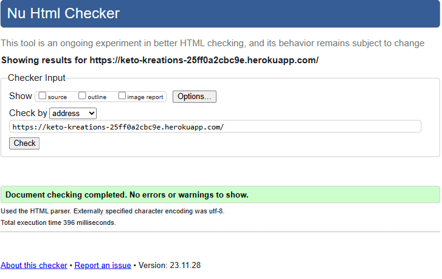
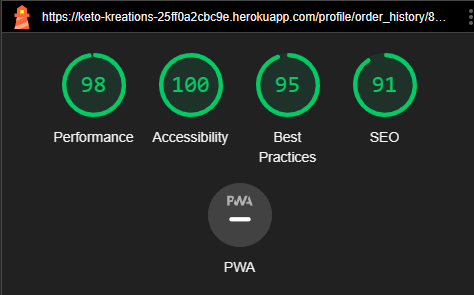
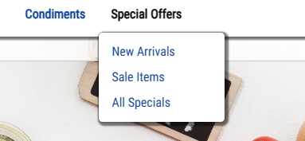
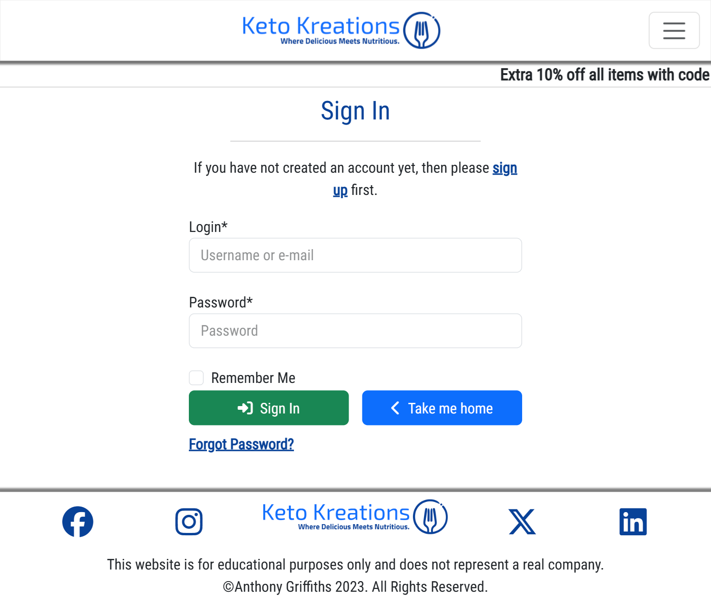
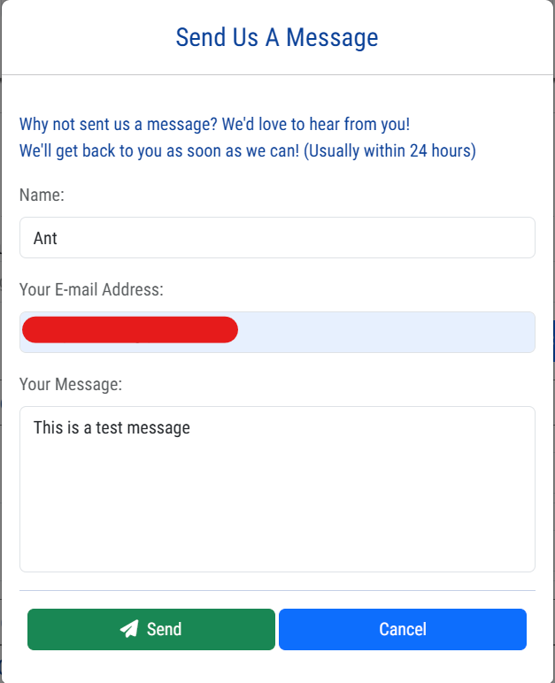

<h1 align="center" id="title"></h1>

<h2 align="center">Testing</h2>

[View the live project here.](https://keto-kreations-25ff0a2cbc9e.herokuapp.com/)

Extensive testing was carried out throughout the life cycle of this project. As well as all of the documented testing below I asked friends and family to use the site and tell me what was and wasn't working. I worked through the website clicking and checking each feature and function one by one and looked for anything that wasn't working or that was logging an error in the console. 

Had I given myself more time I would have liked to have implemented some automated testing using Jest and Django automated testing and is certainly something I will look to implement in future. 

In practice and for production code a combination of both manual and automated testing is important. Automated testing can provide fast results especially across large applications whilst manual testing adds the human element and is more adept at spotting things like intuitiveness of the design. Utilising both can ensure high levels of quality and reliability of web applications.

## AUTOMATED TESTING

#### HTML Validator - [W3C](https://validator.w3.org/)

I was only able to validate the pages that didn't require any form of login or order to be created as with django templates you can't paste the code in directly so had to validate which each pages URL.

| Page | Errors/Warnings | Solution | Image |
| --- | --- | --- | --- |
| Welcome Page | None | N/A |  |
| Login Page | None | N/A |  |
| Register Page | None | N/A |  |
| Password Reset Page | None | N/A |  |
| Products Page | None | N/A |  |
| Product Details Page | None | N/A |  |
| Shopping Bag Page | None | N/A |  |

#### CSS Validator - [W3C](https://jigsaw.w3.org/css-validator/)

| File | Errors/Warnings | Solution | Image |
| --- | --- | --- | --- |
| base.css |  | These errors come from external code I found for the moving discount code bar and don't seem to have any detrimental effect on the site |  |
| checkout.css | -webkit-transition is a vendor extension | N/A - No detrimental effect on the website |  |
| products.css | N/A | N/A |  |
| profile.css | N/A | N/A |  |

#### JSHint Validator - [JSHint](https://jshint.com/)

| File/Page | Errors/Warnings | Solution | Image |
| --- | --- | --- | --- |
| add_edit_product.js | Undefined variable bootstrap | N/A - The bootstrap variable is defined outside the main file so no errors are caused in the terminal |  |
| add_product.html | N/A | N/A |  |
| bag.html | N/A | N/A |  |
| countryfield.js | N/A | N/A |  |
| product_detail.html | N/A | N/A - The submitReviewForm function is called by a button in the HTML so no errors caused in the terminal |  |
| product_management.html | N/A | N/A - The filter function is called by a button in the HTML so no errors caused in the terminal |  |
| products.html | N/A | N/A |  |
| stripe_element.js | N/A | N/A - The Stripe variable is defined outside the main file so no errors are caused in the terminal |  |

#### Python Validator - [Code Institute Python Linter](https://pep8ci.herokuapp.com/) 

I validated all python code that isn't automatically generated with the Code Institute Python Linter and returned no errors so I haven't taken any additional screenshots for these tests.

### Lighthouse

I used Lighthouse within the Chrome Developer Tools to test the performance, accessibility, best practices and SEO of the website. 

| Page | Results |
| --- | --- |
| Add Product |  |
| Add Variant |  |
| Bag |  |
| Checkout |  |
| Checkout Success |  |
| Edit Product |  |
| Edit Variant |  |
| Login |  |
| Logout |  |
| Order History |  |
| Product Details |  |
| Product Management |  |
| Products |  |
| Profile |  |
| Register |  |
| Stock Management |  |
| Welcome |  |

## MANUAL TESTING

### Testing User Stories

<table>
    <thead>
        <tr>
            <th>As a...</th>
            <th>I want to be able to…</th>
            <th>This is achieved by...</th>
            <th>Image</th>
        </tr>
        <tr>
            <th colspan="4">Viewing and Navigation</th>
        </tr>
    </thead>
    <tbody>
        <tr>
            <td>Shopper</td>
            <td>Immediately understand the purpose of the site</td>
            <td>Tell quickly whether this site is going to be of interest to me</td>
            <td></td>
        </tr>
        <tr>
            <td>Shopper</td>
            <td>View a list of products</td>
            <td>A products page listing all available products that is searchable and sortable</td>
            <td></td>
        </tr>
        <tr>
            <td>Shopper</td>
            <td>View individual product details</td>
            <td>The products details page</td>
            <td></td>
        </tr>
        <tr>
            <td>Shopper</td>
            <td>Quickly identify deals, clearance items and special offers</td>
            <td>There is a page category for special offers right in the navbar, all products which are either new or on
                sale also have a badge right next to the product name</td>
            <td>
            
            
            </td>
        </tr>
        <tr>
            <td>Shopper</td>
            <td>Easily view the total of my purchases at any time</td>
            <td>The bag icon in the navbar is updated dynamically with the current total, on mobile view when the navbar
                is collapsed the customer will see there are items in their bag by an icon next to the navbar toggle,
                indicative if they open the navbar they can access the basked and find out.</td>
            <td>
            
            
            
            </td>
        </tr>
        <tr>
            <td>Shopper</td>
            <td>See what past customers think about the products</td>
            <td>By clicking on the product details page they can see past review left by customers</td>
            <td>
            
            </td>
        </tr>
    </tbody>
    <thead>
        <tr>
            <th colspan="4">Registration and User Accounts</th>
        </tr>
    </thead>
    <tbody>
        <tr>
            <td>Registered User</td>
            <td>Easily register for an account</td>
            <td>The register page is easily accessible form the account dropdown in the navbar</td>
            <td>
                
            </td>
        </tr>
        <tr>
            <td>Registered User</td>
            <td>Easily login or logout</td>
            <td>The login and logout buttons are easily accessible from the account dropdown in the navbar</td>
            <td>
                
                
            </td>
        </tr>
        <tr>
            <td>Registered User</td>
            <td>Easily recover my password in case I forget it</td>
            <td>The login page has a prominent forgot my password link to recover a forgotten password</td>
            <td>
                
            </td>
        </tr>
        <tr>
            <td>Registered User</td>
            <td>Receive an email confirmation after registering</td>
            <td>An email is sent upon registration which also needs to be verified by clicking the link in the email
            </td>
            <td>
                
            </td>
        </tr>
        <tr>
            <td>Registered User</td>
            <td>Have a personalised used profile</td>
            <td>The user profile shows default delivery information, past orders as well as past reviews left by the
                customers</td>
            <td>
                
                
            </td>
        </tr>
        <tr>
            <td>Registered User</td>
            <td>Have my email address verified by the site</td>
            <td>All email addresses require verification when a new account is registered</td>
            <td>
                
            </td>
        </tr>
        <tr>
            <td>Registered User</td>
            <td>See my past order history</td>
            <td>This is available in the users profile page</td>
            <td>
                
            </td>
        </tr>
        <tr>
            <td>Registered User</td>
            <td>See my past reviews</td>
            <td>This is available in the users profile page</td>
            <td>
                
            </td>
        </tr>
    </tbody>
    <thead>
        <tr>
            <th colspan="4">Sorting and Searching</th>
        </tr>
    </thead>
    <tbody>
        <tr>
            <td>Shopper</td>
            <td>Sort the list of available products</td>
            <td>Products can be sorted using a range of filters on the main products page as well as categorised in the
                navbar</td>
            <td>
                
                
            </td>
        </tr>
        <tr>
            <td>Shopper</td>
            <td>Sort a specific category of product</td>
            <td>A category can be chosen in the navbar and then sorted with the drop down on the main products page</td>
            <td>
                
                
            </td>
        </tr>
        <tr>
            <td>Shopper</td>
            <td>Sort multiple categories of products simultaneously</td>
            <td>There are broader categories that cover many subcategories which can also be sorted</td>
            <td>
                
                
            </td>
        </tr>
        <tr>
            <td>Shopper</td>
            <td>Search for a product by name or description</td>
            <td>Via the search bar which is always accessible in the navbar</td>
            <td>
                
                
            </td>
        </tr>
        <tr>
            <td>Shopper</td>
            <td>Easily see what I've searched for and the number of results</td>
            <td>Breadcrumbs show the number of results and search term used</td>
            <td>
                
            </td>
        </tr>
        <tr>
            <td>Shopper</td>
            <td>Easily see if a product is out of stock</td>
            <td>A badge is displayed next to all out of stock products on the main product page. Stock levels are also
                highlighted in the product details page</td>
            <td>
                
                
                
            </td>
        </tr>
        <tr>
            <td>Shopper</td>
            <td>Save my billing and shipping details</td>
            <td>These can always be updated via the users profile page or using the save button on the checkout page</td>
            <td>
                
                
            </td>
        </tr>
        <tr>
            <td>Shopper</td>
            <td>Leave my views and feedback about products</td>
            <td>Reviews can be left by all registered users by simply clicking add review on the product detail page
            </td>
            <td>
                  
            </td>
        </tr>
        <tr>
            <td>Shopper</td>
            <td>Edit/Update my reviews</td>
            <td>Reviews can be amended in the users profile page</td>
            <td>
                  
            </td>
        </tr>
        <tr>
            <td>Shopper</td>
            <td>Delete my reviews</td>
            <td>Reviews can be deleted in the users profile page</td>
            <td>
                
            </td>
        </tr>
    </tbody>
    <thead>
        <tr>
            <th colspan="4">Purchasing and Checkout</th>
        </tr>
    </thead>
    <tbody>
        <tr>
            <td>Shopper</td>
            <td>Easily select the size and quantity of a product when purchasing it</td>
            <td>For products with sizes these can easily be selected using the drop down on the product details page
            </td>
            <td>
                
                
            </td>
        </tr>
        <tr>
            <td>Shopper</td>
            <td>View items in my bag to be purchased</td>
            <td>Clicking on the shopping bag icon will take the user to the shopping bag to view their items</td>
            <td>
                
            </td>
        </tr>
        <tr>
            <td>Shopper</td>
            <td>View the total cost of my purchase before checking out</td>
            <td>This is available in the shopping bag page</td>
            <td>
                
            </td>
        </tr>
        <tr>
            <td>Shopper</td>
            <td>Adjust the quantity of individual items in my bag</td>
            <td>Items can be easily updated and removed in the shopping bag page</td>
            <td>
                
                
            </td>
        </tr>
        <tr>
            <td>Shopper</td>
            <td>Easily enter my payment information</td>
            <td>There is a simple box provided by Stripe to enter payment information at checkout</td>
            <td>
                
                
            </td>
        </tr>
        <tr>
            <td>Shopper</td>
            <td>Feel my personal and payment information is safe and secure</td>
            <td>It is clear to the customer on the button they click to access the checkout that it is secure. Stripe is
                also a brand that people know and trust</td>
            <td>
                
            </td>
        </tr>
        <tr>
            <td>Shopper</td>
            <td>View an order confirmation at checkout</td>
            <td>After checkout the customer is taken to an order confirmation page as well as being emailed an order
                confirmation</td>
            <td>
                
                
            </td>
        </tr>
        <tr>
            <td>Shopper</td>
            <td>Receive an email confirmation after checking out</td>
            <td>Customers are immediately sent a confirmation email upon completion of a successful order</td>
            <td>
                
            </td>
        </tr>
        <tr>
            <td>Shopper</td>
            <td>Contact the store easily with any questions or concerns</td>
            <td>Users can send messages directly to the store by clicking the contact icon in the navbar</td>
            <td>
                
                
            </td>
        </tr>
        <tr>
            <td>Shopper</td>
            <td>See what discounts have been applied to my order</td>
            <td>Discount information is supplied in the shopping bag, checkout and order confirmation</td>
            <td>
                
            </td>
        </tr>
        <tr>
            <td>Shopper</td>
            <td>See at a glance if there are any items in my shopping basket</td>
            <td>On larger screens the bag icon will show the total price of items in the bag, on smaller screens an icon
                is depicted on the navbar toggler</td>
            <td>
                
                
                
            </td>
        </tr>
        <tr>
            <td>Shopper</td>
            <td>Be informed if the store doesn't have enough stock to fulfill the amount I need</td>
            <td>A users selected quantity is checked against current stock before an order is place, if the stock levels
                are too low the customer will not be able to proceed and will be provided a message on screen stating as
                such</td>
            <td>
                 
            </td>
        </tr>
        <tr>
            <td>Shopper</td>
            <td>See how much I need to spend to qualify for free shipping</td>
            <td>This is always shown in the shopping bag and shopping bag preview toast</td>
            <td>
                 
                 
            </td>
        </tr>
        <tr>
            <td>Shopper</td>
            <td>Be able to checkout without registering for an account</td>
            <td>Anyone can checkout anonymously, an account is not required to check out as is evidenced by this image on the checkout page where customers are prompted to sign up if they want to save their details for future but are not obligated to</td>
            <td>
                
            </td>
        </tr>
    </tbody>
    <thead>
        <tr>
            <th colspan="4">Admin and Store Management</th>
        </tr>
    </thead>
    <tbody>
        <tr>
            <td>Store Owner/Staff Member</td>
            <td>Add a product</td>
            <td>New items can be added in the product management section</td>
            <td></td>
        </tr>
        <tr>
            <td>Store Owner/Staff Member</td>
            <td>Edit/Update a product</td>
            <td>Items can be amended in the product management section</td>
            <td>
                
                
            </td>
        </tr>
        <tr>
            <td>Store Owner/Staff Member</td>
            <td>Delete a product</td>
            <td>Items can be deleted in the product management section</td>
            <td>
                
                
            </td>
        </tr>
        <tr>
            <td>Store Owner/Staff Member</td>
            <td>Manage Stock levels</td>
            <td>Stock can be easily updated by editing the individual product or by using the stock management page
                located in the product management section</td>
            <td>
                
            </td>
        </tr>
        <tr>
            <td>Store Owner/Staff Member</td>
            <td>Add a discount code</td>
            <td>Discounts codes can be added in the product management section</td>
            <td>
                
            </td>
        </tr>
        <tr>
            <td>Store Owner/Staff Member</td>
            <td>Edit/Update a discount code</td>
            <td>Discounts codes can be amended in the product management section</td>
            <td>
                
            </td>
        </tr>
        <tr>
            <td>Store Owner/Staff Member</td>
            <td>Delete a discount code</td>
            <td>Discounts codes can be removed in the product management section</td>
            <td>
                
            </td>
        </tr>
    </tbody>
</table>

### Devices Used For Testing

The site has altogether in one way or another been used and tested on the following devices...

-   Google Pixel 7 - Chrome
-   HP Elitebook (Windows) - Chrome, Edge and Firefox
-   Iphone SE - Safari and Chrome
-   Ipad - Safari and Chrome
-   Macbook Pro - Safari and Chrome
-   Samsung Galaxy Tab S7 - Chrome and Samsung Browser
-   Samsung S23 Ultra - Edge, Chrome, Firefox and Samsung Browser

### Full Manual Testing

#### Welcome Page

| Feature/Action        | Pass/Fail |
|-----------------------|-----------|
| Shop now button takes you to the product page | Pass      |

#### Navbar
| Feature/Action | Pass/Fail |
|----------------|-----------|
| Logo takes you back to the home page | Pass |
| Search bar works and loads the products page with the correct results | Pass |
| All links to product categories take you to the correct page | Pass |
| Account drop down and dropdown links all work and take you to the correct page | Pass |
| Bag button works and takes you to the bag page | Pass |
| Bag button updates dynamically when new items are added to the cart | Pass |
| Contact button launches the contact modal | Pass |
| Contact modal successfully submits a message to the store and both the customer and store receive confirmation emails | Pass |
| Form validation in contact modal works | Pass |
| Navbar collapes to mobile nav on smaller screens | Pass |
| When there are items in the shopping bag a badge appears over the navbar toggler | Pass |
| All links in mobile nav behave identically to the full navbar | Pass |
| Sidenav collapses correctly on click of x or when you click outside the nav | Pass |

#### Footer
| Feature/Action | Pass/Fail |
|----------------|-----------|
| Footer logo takes you to the home page on click | Pass |
| Social links open the correct page in a new tab | Pass |

#### Products Page
| Feature/Action | Pass/Fail |
|----------------|-----------|
| All product images and links are clickable and take you to the correct product | Pass      |
| Sort function sorts the products correctly                                     | Pass      |
| All images are rendered correctly                                              | Pass      |
| New and sales badges are clickable and take you to the correct page | Pass      |
| Product tags are clickable and take you to the correct page | Pass      |

#### Product Details Page
| Feature/Action | Pass/Fail |
|----------------|-----------|
| Product image loads full size in a new tabe on click                                   | Pass      |
| Quantity selector buttons work correctly and are disables outside the range of 1-99    | Pass      |
| Size selector drop down works correctly and dynamically updates the price              | Pass      |
| Ingredients, allergens and nutritional information dropdowns work correctly            | Pass      |
| Review caoursel buttons work and cycle through reviews                                 | Pass      |
| Add review button works and launches the modal                                         | Pass      |
| Add review modal submits review and is visible on the page                             | Pass      |
| Items are added correctly to the shopping bag and the correct success message is shown | Pass      |
| Keep shopping button takes you back to the products page                               | Pass      |
| Sale and new badges are clickable taking you to the relevant pages                     | Pass      |

#### Bag Page
| Feature/Action | Pass/Fail |
|----------------|-----------|
| Quantity selector buttons works and are disabled outside the range of 1-99 | Pass |
| Update button updates the number of items in the bag | Pass |
| Remove button removes the product from the bag | Pass |
| Discount box works and applies the correct discounts | Pass |
| Subtotal updates dynamically after bag changes | Pass |
| Bag total, delivery, discount and grand total all update dynamically and correctly on bag changes | Pass |
| Product image and name take you back to the product detail page | Pass |
| Keep shopping button takes you back to the products page | Pass |
| Checkout button takes you to the checkout page | Pass |

#### Checkout Page
| Feature/Action | Pass/Fail |
|----------------|-----------|
| Users delivery details are pre filled if they are already saved | Pass |
| Order details and line items are correct | Pass |
| Order total, delivery, discount and grand total are all correct | Pass |
| Form validation works when incorrect details are entered such as not entering a properly formatted email | Pass |
| Card validation works and error messages are shown correctly when validation fails | Pass |
| Adjust bag button takes you back to the bag page | Pass |
| Complete order button process order and redirect user to checkout success page upon successful order | Pass |

#### Checkout Success Page
| Feature/Action | Pass/Fail |
|----------------|-----------|
| Order details are displayed correctly | Pass |
| User gets a success message which also confirms the order was successful | Pass |
| Order confirmation email is sent to the user | Pass |
| Checkout our latest deals button takes the user to the all specials page | Pass |

#### Product Management Page
| Feature/Action | Pass/Fail |
|----------------|-----------|
| Add/Edit product button and add/edit variant buttons redirects to the correct pages | Pass |
| Delete product/variant buttons work and allow you to filter products and launches the delete modal upon selction of a product | Pass |
| Add discount button launches the add  discount modal | Pass |
| Add discount modal works, along with form validation and correctly add the discount code to the DB | Pass |
| Edit discount button works and allows you to filter the discount codes and upon selection launches the edit discount modal | Pass |
| Edit discount modal works, along with form validation and correctly update the discount code in the database | Pass |
| Stock management button works and redirects user to the stock management page | Pass |

#### Profile Page 
| Feature/Action | Pass/Fail |
|----------------|-----------|
| Default delivery info is populated with previously saved data if there is any | Pass |
| Form validation works and correctly updates the users info in the database upon submission | Pass |
| Order history shows all past order for the customer and upon clicking the order number takes them to the order details | Pass |
| Reviews section shows all past reviews customer has left | Pass |
| Edit review launches the edit review modal | Pass |
| Edit review modal works correctly with form validation and correctly updates the review in the database | Pass |
| Delete review button launches the delete review modal | Pass |
| Delete review modal correctly deletes the review from the database | Pass |

#### 404 Page
| Feature/Action | Pass/Fail |
|----------------|-----------|
| Customer 404 page is rendered when a 404 error happens | Pass |
| Take me back home button returns the user to the welcome page | Pass |

#### Add Product
| Feature/Action | Pass/Fail |
|----------------|-----------|
| Add product form validation works correctly and ensures the user is entering the correct details | Pass |
| If the variant checkbox is checked/unchecked the correct modal launches advising the user of how to proceed and confirming they are happy to  | Pass |
| If the sale checkbox is checked/unchecked the correct modal launches advising the user of how to proceed and confirming they are happy to | Pass |
| Select image button works and correctly loads the selected image | Pass |
| Cancel button return the user to the product management page | Pass |
| Add product button correctly adds the product to the database and return the user to the product management page | Pass |

#### Add Variant
| Feature/Action | Pass/Fail |
|----------------|-----------|
| Add variant form validation works correctly and ensures the user is entering the correct details | Pass |
| Cancel button return the user to the product management page | Pass |
| Add variant button correctly adds the product to the database and return the user to the product management page | Pass |

#### Edit Product
| Feature/Action | Pass/Fail |
|----------------|-----------|
| Existing product information is correctly loaded to the form | Pass |
| Edit product form validation works correctly and ensures the user is entering the correct details | Pass |
| If the variant checkbox is checked/unchecked the correct modal launches advising the user of how to proceed and confirming they are happy to  | Pass |
| If the sale checkbox is checked/unchecked the correct modal launches advising the user of how to proceed and confirming they are happy to | Pass |
| Select image button works and correctly loads the selected image | Pass |
| Cancel button return the user to the product management page | Pass |
| Edit product button correctly updates the product in the database and returns the user to the product management page | Pass |

#### Edit Variant
| Feature/Action | Pass/Fail |
|----------------|-----------|
| Existing variant information is correctly loaded to the form | Pass |
| Edit variant form validation works correctly and ensures the user is entering the correct details | Pass |
| Cancel button return the user to the product management page | Pass |
| Edit variant button correctly updates the product in the database and returns the user to the product management page | Pass |

#### Login Page
| Feature/Action | Pass/Fail |
|----------------|-----------|
| Form validation works | Pass |
| Sign up button redirects the user to the sign up page | Pass |
| Forgot password button redirects the user to the forgot password page | Pass |
| Take me home button redirects user to the home page | Pass |
| Sign in logs the user in assuming their details are correct and redirects them to the homepage with a success message | Pass |

#### Logout Page
| Feature/Action | Pass/Fail |
|----------------|-----------|
| Take me home button redirects the user back to the home page | Pass |
| Sign out button successfully signs the user out and redirects them to the home page with a success message | Pass |

#### Register Page
| Feature/Action | Pass/Fail |
|----------------|-----------|
| Form validation works correctly and ensure emails match, passwords match, password isn't too weak and no user exists with those details | Pass |
| Sign in button redirects the user to the home page | Pass |
| Sign up button creates an account and sends a confirmation email for verification | Pass |

#### Reset Password Page
| Feature/Action | Pass/Fail |
|----------------|-----------|
| When a correct email is entered the user is sent an email to reset their password | Pass |
| When the email link is clicked the user is prompted to create a new password | Pass |
| Password validation works ensuring a previous password and a weak password isn't used | Pass |
| Password is correctly updated in the database for future logins | Pass |

## Bugs

### Solved Bugs

| No. | Bug. | How I solved the issue |
|---|---|---|
| 1 | Missing default value in the product model meant I couldn't migrae my data | Added the missing default value |
| 2 | As I made the sale price field default to 0 in the models the filtering by sale item was no longer working.  | Changed sale_price__isnull=False to sale_price__gt=0 which fixed the issue |
| 3 | Price sorting stopped working | Changed method of how the lowest price per product is determined which fixed the issue |
| 4 | Receiving an error SMTP.starttls() got an unexpected keyword argument 'keyfile' in heroku but emails work in local environment. | Set python version for heroku to same as local environment version. |
| 5 | Quantity form on the bag page no longer worked correctly after styling update as there was now essentially 2 versions of the same form on the page with the same ID just one was hidden on mobile view and the other was hidden on large views. | Removed the ID and identified them using classes instead and updated the JS code to work correctly with the new structure |
| 6 | Checkout page was not saving names and emails when user opted to save their info | Updated the view to also get the name and email from the form and update the user profile accordingly |
| 7 | Contact confirmation email wasn't sending to the user | This was human error in testing, I was using the same email as the store email to test the contact form so only the store was receive the email and the 'user' was not |
| 8 | Couldn't check out as an anonymous user | Initialised discount code to 0 as the error was stating python couldn't access a non existent variable |
| 9 | Modals not working on the add product page | They had been accidently deleted at some point so had to re-code them |
| 10 | Crispy forms with bootstrap 5 doesn't work with this version of Django | Continued to use bootstrap 5 for styling, but some styling was no long working with crispy forms as the classes for bootstrap 4 are slightly different. Manually styled some forms or created the correct classes using widgets/attributes in the python forms. |

### Unsolved Bugs
| No. | Bug. |
|---|---|
| 1 | Bag items are removed from the bag once a user logs out |  |
| 2 | Product ratings correctly updates when a review is deleted by a user through the website but not when the review is deleted using the admin panel |